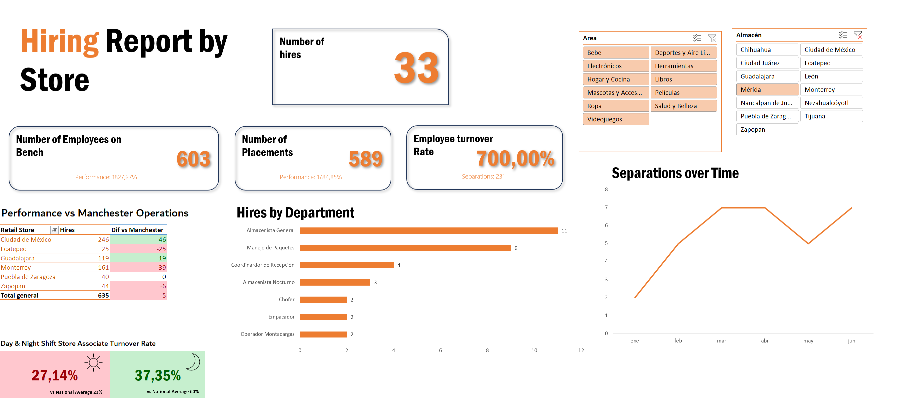

# HR Analytics Dashboard (Excel)

## Project Overview

This project presents an interactive HR dashboard built in Excel to analyze hiring trends, employee turnover, and workforce performance across multiple warehouse locations.

The dashboard was designed to replace manual reporting processes and provide managers with a dynamic and efficient tool for decision-making.

---

## Business Problem

The company faced inefficiencies in reporting HR data across more than 100 managers, requiring the creation of multiple PowerPoint reports every month.

Additionally, the company is concerned about high employee turnover, especially in warehouse operations, and aims to reduce it below industry benchmarks.

---

## Objectives

* Analyze hiring and termination trends
* Measure employee turnover rate
* Compare performance across locations
* Provide an interactive dashboard for decision-making

---

## Dataset

The dataset includes:

* Hiring data
* Employee separations
* Store locations
* Departments and job roles
* Time period: First semester of 2017

Note: The dataset is in Spanish, while the dashboard and analysis are presented in English.

---

## Project Structure

The project is organized into separate files to reflect different stages of the data analysis process:

* Raw Dataset: Original unprocessed data
* Processed Dataset: Cleaned data and pivot tables used for analysis
* Dashboard File: Final interactive dashboard connected to the processed data

This structure simulates a real-world workflow where data preparation and visualization are handled separately.

---

## Key Metrics

* Number of Hires
* Number of Placements
* Employees on Bench
* Employee Turnover Rate
* Performance vs Competitor

---

## Dashboard Features

* Interactive filters (Area and Store)
* KPI cards for quick insights
* Comparison table vs competitor performance
* Department-level hiring analysis
* Time series analysis for employee separations
* Day vs Night shift turnover comparison

---

## Key Insights

* The employee turnover rate is significantly high, indicating retention challenges.
* Night shift turnover is considerably higher than day shift, aligning with industry trends.
* Some locations outperform competitors, while others show performance gaps.
* Hiring is concentrated in operational roles such as warehouse and logistics positions.
* Employee separations show fluctuations over time, suggesting workforce instability.

---

## Tools Used

* Microsoft Excel
* Pivot Tables
* Data Cleaning
* Data Visualization
* Dashboard Design

---

## Dashboard Preview

---

## Impact

This dashboard reduces reporting time and enables managers to quickly identify trends, compare performance, and make data-driven decisions to improve employee retention and operational efficiency.
